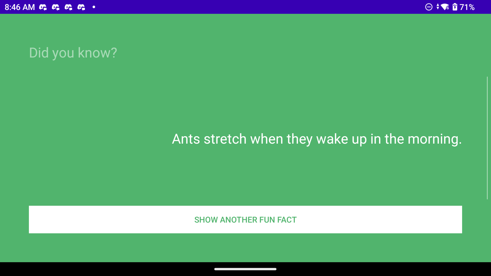

# DidYouKnowAndroidApp

An Android app that generates random fun facts — a simple trivia-style knowledge feed to keep you learning something new every day.

*The app running on an Android device, showing a random fun fact and the "Show Another Fun Fact" button.*

## Features
- Displays a new random fun fact on each tap
- Clean, minimal interface
- Lightweight and fast

## Tech Stack
- **Language**: Java
- **Platform**: Android
- **Build**: Gradle / Android Studio

## Getting Started
1. Clone the repo
2. Open in Android Studio
3. Run on an emulator or Android device
